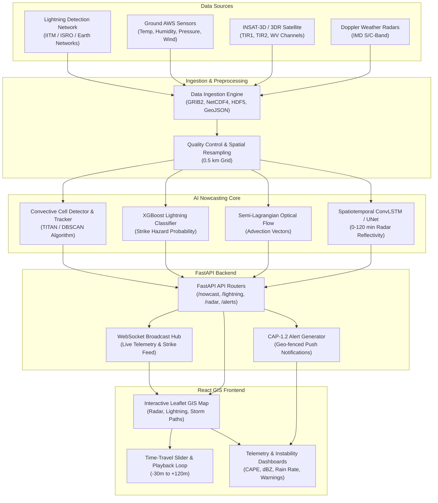

# ⚡ AI-Powered Thunderstorm & Lightning Nowcasting System (SIH26072)

[](https://fastapi.tiangolo.com)
[](https://react.dev)
[](https://tailwindcss.com)
[](https://leafletjs.com)
[](https://www.python.org/)
[](LICENSE)

An end-to-end, high-resolution **0–3 hour Spatiotemporal Weather Nowcasting Web Platform** designed for real-time detection, tracking, and predictive early-warning of severe convective thunderstorms, cloud-to-ground (CG) lightning strikes, cloudburst downpours, and squall lines across the Indian subcontinent.

---

## 📌 Table of Contents
- [Project Overview](#-project-overview)
- [System Architecture](#-system-architecture)
- [Key Features](#-key-features)
- [Data Ingestion & AI Pipeline](#-data-ingestion--ai-pipeline)
- [Folder Structure](#-folder-structure)
- [API Reference](#-api-reference)
- [Frontend GIS Capabilities](#-frontend-gis-capabilities)
- [Quick Start Guide](#-quick-start-guide)
  - [Prerequisites](#prerequisites)
  - [Backend Setup (FastAPI)](#backend-setup-fastapi)
  - [Frontend Setup (React + Vite)](#frontend-setup-react--vite)
  - [Docker Deployment](#docker-deployment)
- [Meteorological Formulations](#-meteorological-formulations)

---

## 🌦 Project Overview

Thunderstorms and lightning strikes represent one of the most fatal and sudden meteorological disasters. Conventional Numerical Weather Prediction (NWP) models (e.g., WRF, GFS) operate at 3-to-6-hour update cycles and lack the sub-kilometer spatiotemporal granularity required to predict rapid convective cell genesis.

This solution integrates:
1. **Multi-Source Geospatial Ingestion**: Doppler Weather Radar (DWR) volume scans, INSAT-3D/3DR multispectral satellite channels (TIR1, TIR2, WV), ground Automatic Weather Stations (AWS), and Lightning Detection Networks.
2. **Hybrid AI Nowcasting**: Spatiotemporal ConvLSTM / Deep UNet models coupled with semi-Lagrangian optical flow to extrapolate radar reflectivity ($\text{dBZ}$) and predict storm cell kinematics.
3. **Multi-Parameter Lightning Risk Modeling**: Gradient-boosted ensembles (XGBoost) evaluating thermodynamic instability ($\text{CAPE}$, $\text{CIN}$), Vertically Integrated Liquid ($\text{VIL}$), and Cloud Top Brightness Temperatures ($T_B$).
4. **Interactive GIS Dashboard**: Dark-mode Leaflet map interface with continuous $-30\text{m}$ to $+120\text{m}$ playback, severe weather alert bulletins (CAP-1.2), and real-time WebSocket telemetry.

---

## 🏗 System Architecture



---

## ⚡ Key Features

- **0–120 Minute High-Resolution Precipitation Nowcast**: Predicts rainfall intensity and $\text{dBZ}$ reflectivity contours at 10-minute intervals.
- **Predictive Lightning Strike Probability**: Pinpoints high-risk ground discharge zones $15\text{–}60$ minutes prior to strike onset.
- **Storm Cell Trajectory Extrapolation**: Computes convective cell centroids, velocity vectors, echo top heights, and projected paths.
- **Time-Travel Playback**: Seamlessly scrub between historical radar observations ($-30\text{m}$) and AI-predicted future frames ($+120\text{m}$).
- **CAP 1.2 Compliant Early Warnings**: Automated generation of emergency bulletins for disaster management authorities (NDRF/SDMA).
- **Responsive Dark-Themed UI**: Built using React, Tailwind CSS, Lucide icons, and Leaflet GIS overlays.

---

## 📂 Folder Structure

```
AI-Powered Thunderstorm & Lightning System/
├── .gitignore                      # Git ignore file for Python, Node, and model checkpoints
├── README.md                       # Master project documentation
├── backend/                        # FastAPI Backend Application
│   ├── .env.example                # Backend environment configuration template
│   ├── Dockerfile                  # Container definition for backend services
│   ├── requirements.txt            # Python dependencies (FastAPI, NumPy, SciPy, SQLAlchemy)
│   ├── app/
│   │   ├── __init__.py
│   │   ├── config.py               # Application settings & environment loader
│   │   ├── database.py             # Async SQLAlchemy database engine & sessions
│   │   ├── main.py                 # FastAPI application entry point & WebSocket hub
│   │   ├── models/                 # Database and Pydantic validation schemas
│   │   │   ├── __init__.py
│   │   │   ├── db_models.py        # SQLAlchemy ORM entities (Alerts, Stations, Cells)
│   │   │   ├── ml_models.py        # Machine learning registry & metadata schema
│   │   │   └── schemas.py          # Pydantic models for requests and responses
│   │   ├── routers/                # REST API Endpoint Routers
│   │   │   ├── __init__.py
│   │   │   ├── alerts.py           # CAP severe weather warning endpoints
│   │   │   ├── lightning.py        # Strike detection & hazard grid endpoints
│   │   │   ├── nowcast.py          # 0-3hr precipitation & cell tracking endpoints
│   │   │   ├── radar.py            # Doppler Weather Radar volume scan endpoints
│   │   │   └── satellite.py        # INSAT-3D/3DR product metadata endpoints
│   │   ├── services/               # Core Business Logic & AI Engines
│   │   │   ├── __init__.py
│   │   │   ├── ai_inference.py     # Spatiotemporal ConvLSTM inference service
│   │   │   ├── alert_service.py    # Geo-fencing & emergency alert broadcaster
│   │   │   ├── data_ingestion.py   # DWR, INSAT, and AWS station data loaders
│   │   │   └── lightning_engine.py # Multi-sensor lightning risk calculation
│   │   └── utils/                  # Meteorological & GIS Calculation Utilities
│   │       ├── __init__.py
│   │       ├── geo_utils.py        # Haversine distance, bounding box, grid tools
│   │       └── meteorological.py   # Z-R Marshall-Palmer, CAPE, dBZ conversions
│   └── ml_pipeline/                # Machine Learning Training & Weights Directory
│       ├── __init__.py
│       ├── optical_flow.py         # Semi-Lagrangian radar advection baseline
│       └── model_checkpoints/      # ONNX / PyTorch neural network weights
│           └── README.md
└── frontend/                       # React + Vite + Tailwind CSS Frontend
    ├── .env.example                # Frontend environment variables template
    ├── index.html                  # HTML5 entry with Leaflet stylesheet
    ├── package.json                # NPM dependencies & build scripts
    ├── postcss.config.js           # PostCSS configuration
    ├── tailwind.config.js          # Tailwind CSS design system configuration
    ├── vite.config.js              # Vite bundler & API reverse proxy configuration
    ├── public/                     # Static assets (Favicon, icons)
    │   └── favicon.svg
    └── src/
        ├── App.jsx                 # Master application component & layout state
        ├── index.css               # Global Tailwind directives & Leaflet styling
        ├── main.jsx                # React DOM root mounting script
        ├── components/
        │   ├── Common/             # Reusable UI primitives
        │   │   ├── AlertBadge.jsx  # Severity status pill badges
        │   │   ├── Legend.jsx      # Meteorological dBZ color scale legend
        │   │   └── LoadingSpinner.jsx # Async state spinner
        │   ├── Dashboard/          # Analytics & Telemetry Panels
        │   │   ├── AlertFeed.jsx   # Live CAP bulletin & warning cards
        │   │   ├── Header.jsx      # Top navigation, status pills & refresh button
        │   │   ├── LayerControlPanel.jsx # GIS map layer visibility toggles
        │   │   ├── MetricsPanel.jsx # 0-120 min high-res forecast curves
        │   │   ├── RiskSummaryCard.jsx # Instant atmospheric instability widget
        │   │   └── TimelineControls.jsx # Play/Pause loop & minute scrubber
        │   └── Map/                # Leaflet Geospatial Visualization Components
        │       ├── LightningLayer.jsx # Flash markers & hazard risk grid
        │       ├── RadarOverlay.jsx # Dynamic radar reflectivity advection
        │       ├── StationMarkers.jsx # Ground AWS telemetry popups
        │       ├── StormCellTracker.jsx # Convective cell paths & heading vectors
        │       └── WeatherMap.jsx  # Core Leaflet map container
        ├── services/
        │   ├── api.js              # Axios backend API client with offline fallbacks
        │   └── websocket.js        # Real-time WebSocket connection manager
        └── utils/
            ├── colorScales.js      # dBZ radar colormaps & severity styling
            └── dateUtils.js        # UTC / IST time formatters
```

---

## 📡 API Reference

### 1. Nowcasting Endpoints (`/api/v1/nowcast`)
- `GET /api/v1/nowcast/summary?lat={lat}&lon={lon}&radius_km={radius}&lead_time_min={min}`
  - Returns comprehensive nowcasting summary, thermodynamic indices ($\text{CAPE}$, $\text{CIN}$), storm cell vectors, and 10-minute timeline curves.
- `GET /api/v1/nowcast/storm-cells?lat={lat}&lon={lon}&radius_km={radius}`
  - Returns active convective cells with radar echo tops, $\text{VIL}$, speed, heading, and projected track coordinates.

### 2. Lightning Hazard Endpoints (`/api/v1/lightning`)
- `GET /api/v1/lightning/recent-strikes?lat={lat}&lon={lon}&radius_km={radius}&lookback_minutes={min}`
  - Returns detected Cloud-to-Ground (CG) and Intra-Cloud (IC) lightning flashes with peak currents ($\text{kA}$).
- `GET /api/v1/lightning/prediction-grid?lat={lat}&lon={lon}&radius_km={radius}&horizon_min={min}`
  - Computes spatial lightning probability grid ($0.0\text{–}1.0$) and flags critical hotspots.

### 3. Radar & Satellite Endpoints (`/api/v1/radar`, `/api/v1/satellite`)
- `GET /api/v1/radar/frames?radar_station={code}`
  - Retrieves sequence of observed ($-30\text{m}$ to $0\text{m}$) and predicted ($+15\text{m}$ to $+120\text{m}$) radar frames.
- `GET /api/v1/radar/stations`
  - Lists operational Doppler Weather Radars across India.
- `GET /api/v1/satellite/products`
  - Metadata for INSAT-3D/3DR TIR1, TIR2, and Water Vapor channels.

### 4. Alerts & Telemetry (`/api/v1/alerts`)
- `GET /api/v1/alerts/active?lat={lat}&lon={lon}`
  - Active Common Alerting Protocol (CAP-1.2) warnings with GeoJSON bounding polygons.
- `GET /api/v1/alerts/aws-stations`
  - Live telemetry from surface Automatic Weather Stations.

---

## 🗺 Frontend GIS Capabilities

- **Interactive Leaflet Base Map**: High-contrast CartoDB Dark Matter base layer optimized for displaying vivid radar colormaps.
- **Dynamic Advection Simulation**: Visualizes storm cell translation and decay as time offset changes.
- **Layer Toggle Management**: Independently toggle Radar $\text{dBZ}$, Lightning Strikes, Storm Tracks, AWS Stations, and Warning Polygons.
- **Real-Time Telemetry Cards**: Inspect rain rate ($\text{mm/hr}$), $\text{dBZ}$, $\text{CAPE}$ ($\text{J/kg}$), wind gusts ($\text{km/h}$), and arrival lead times.

---

## 🚀 Quick Start Guide

### Prerequisites
- **Python**: 3.10+
- **Node.js**: 18.0+ and `npm`

---

### Backend Setup (FastAPI)

1. Navigate to the `backend/` directory:
   ```bash
   cd backend
   ```

2. Create and activate a Python virtual environment:
   ```bash
   # Windows (PowerShell)
   python -m venv .venv
   .venv\Scripts\Activate.ps1

   # Linux / macOS
   python3 -m venv .venv
   source .venv/bin/activate
   ```

3. Install required Python packages:
   ```bash
   pip install -r requirements.txt
   ```

4. Start the FastAPI development server:
   ```bash
   uvicorn app.main:app --host 127.0.0.1 --port 8000 --reload
   ```

5. Access interactive Swagger API documentation at:
   - **Swagger UI**: [http://localhost:8000/docs](http://localhost:8000/docs)
   - **ReDoc**: [http://localhost:8000/redoc](http://localhost:8000/redoc)

---

### Frontend Setup (React + Vite)

1. Navigate to the `frontend/` directory:
   ```bash
   cd frontend
   ```

2. Install Node dependencies:
   ```bash
   npm install
   ```

3. Start the Vite development server:
   ```bash
   npm run dev
   ```

4. Open your browser and navigate to:
   - **Web Application**: [http://localhost:5173](http://localhost:5173)

---

### Docker Deployment

To launch the full backend containerized:

```bash
cd backend
docker build -t nowcast-backend:latest .
docker run -p 8000:8000 nowcast-backend:latest
```

---

## 📐 Meteorological Formulations

### 1. Marshall-Palmer Radar Reflectivity to Rain Rate ($Z\text{-}R$ Relationship)
The radar reflectivity factor $Z$ ($\text{mm}^6/\text{m}^3$) is converted to precipitation intensity $R$ ($\text{mm/hr}$) using:
$$Z = a \cdot R^b \implies R = \left( \frac{10^{\frac{\text{dBZ}}{10}}}{a} \right)^{\frac{1}{b}}$$
- Standard Convective Mode: $a = 300$, $b = 1.4$
- Stratiform Precipitation Mode: $a = 200$, $b = 1.6$

### 2. Composite Lightning Strike Hazard Index ($L_{\text{risk}}$)
$$L_{\text{risk}} = 0.35 \cdot \hat{S}_{\text{dBZ}} + 0.30 \cdot \hat{S}_{\text{CAPE}} + 0.20 \cdot \hat{S}_{T_B} + 0.15 \cdot \hat{S}_{\text{VIL}}$$
Where:
- $\hat{S}_{\text{dBZ}}$ = Normalized Radar Core Reflectivity ($25\text{–}55\,\text{dBZ}$)
- $\hat{S}_{\text{CAPE}}$ = Normalized Convective Available Potential Energy ($500\text{–}3000\,\text{J/kg}$)
- $\hat{S}_{T_B}$ = Normalized Cloud Top Brightness Temperature ($-10^\circ\text{C}\text{ to }-60^\circ\text{C}$)
- $\hat{S}_{\text{VIL}}$ = Vertically Integrated Liquid Water Content ($5\text{–}30\,\text{kg/m}^2$)

---

## 👥 Contributors & Hackathon Reference
- **Problem Statement ID**: SIH26072
- **Domain**: AI for Disaster Management, Weather Forecasting & Public Safety
